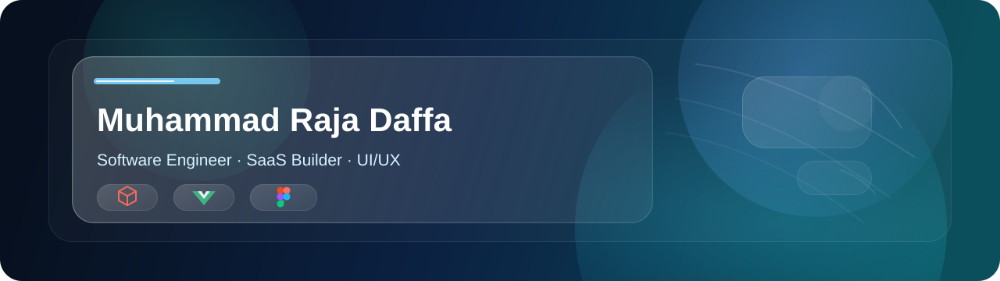

# 

  ☕ Coding Enthusiast | 🎨 UI/UX | Software Engineer | Junior Developer

  <a href="https://yazid-archive.vercel.app">Portfolio</a>
  ·
  <a href="https://www.linkedin.com/in/muhammad-yazid-hazami-a35520410/?locale=en-US">LinkedIn</a>
  ·
  <a href="mailto:hazamiyazid01@gmail.com">Email</a>

  
  
  

## About Me
I'm a passionate student developer who loves exploring how things work behind the scenes. Even while studying, I've dedicated my time to building real-world applications across various platforms. I'm always eager to learn new technologies and improve my coding skills.

## Tech Stack

  <!-- Programming Languages -->
  
  
  
  
  
  
  
  
  
  
  
  
  
  
  
  
  
  
  
  
  
  

  

  <!-- <picture>
    <source media="(prefers-color-scheme: dark)" srcset="https://raw.githubusercontent.com/Chizuyu/Chizuyu/output/pacman-contribution-graph-dark.svg" />
    <source media="(prefers-color-scheme: light)" srcset="https://raw.githubusercontent.com/Chizuyu/Chizuyu/output/pacman-contribution-graph.svg" />
    
  </picture> -->
  <picture>
    <source media="(prefers-color-scheme: dark)" srcset="https://raw.githubusercontent.com/Chizuyu/Chizuyu/output/pacman-contribution-graph-dark.svg" />
    <source media="(prefers-color-scheme: light)" srcset="https://raw.githubusercontent.com/Chizuyu/Chizuyu/output/pacman-contribution-graph.svg" />
    
</picture>

